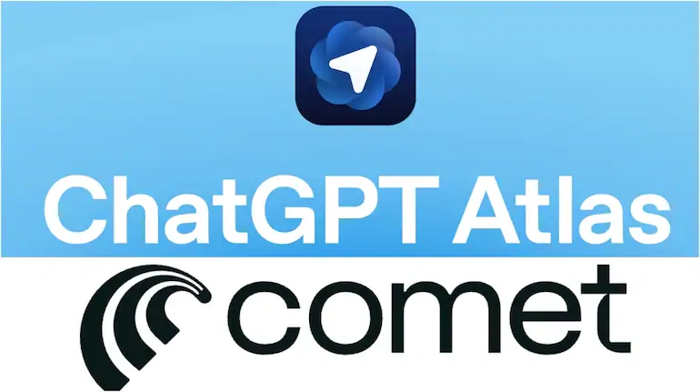

# ChatGPT Atlas 和 Perplexity Comet：两种AI浏览器的较量

---

当你打开浏览器准备工作时，你更希望AI帮你"完成任务"，还是"帮你做决策"？这个问题听起来简单，但它决定了你该选择哪种AI浏览器。ChatGPT Atlas 想成为你的自动化助手，而 [Perplexity Comet](https://pplx.ai/ixkwood69619635) 更像是一个随时待命的智能研究员。两者都很强，但强的方向完全不同。

---

## 一个会干活，一个会找答案

ChatGPT Atlas 的逻辑是：你告诉它要什么，它自己规划步骤、调用工具、修正错误，最后把结果交给你。比如你让它做一份数据报表，它会自己去抓数据、整理格式、生成文件。整个过程你可以不管，只需要在关键节点确认一下"可以继续吗"。

[Perplexity Comet](https://pplx.ai/ixkwood69619635) 不是这样。它不会替你执行任何操作，但它会实时从网上找信息、验证来源、整理成你能直接用的内容。你想查某个技术文档的最新版本？它帮你找到并标注出处。你想了解某个新闻事件的多方说法？它把不同角度的报道摆在你面前。但最后的决定权，始终在你手里。

简单说：Atlas 是"我帮你做完"，Comet 是"我帮你搞清楚"。

---

## 自动化 vs 透明化

Atlas 的核心能力是**端到端执行**。它可以跨应用操作——从浏览器到终端到API接口，像一个真正的助手那样串联起多个工具。你给它一个目标，它自己拆解成子任务，一步步完成。这种"代理模式"（agentic mode）的好处是省心，但前提是你得信任它，并且你的指令得足够清晰。

Comet 没有这种自主执行能力。它的设计哲学是：**AI 应该增强你的判断，而不是替代你的决策**。所以它做的事情都是"辅助性"的——帮你快速浏览、总结信息、验证事实，但不会替你点击"提交"或"发送"。这种设计对研究型工作特别友好，因为你需要的是信息质量和可追溯性，而不是自动化。

---

## 结果导向 vs 决策导向

用 Atlas 的时候，你期待的输出是**一个完成的任务**：一份编译好的表格、一个排好的日程、一套生成的幻灯片。它的价值在于"帮你省时间"。

用 [Comet](https://pplx.ai/ixkwood69619635) 的时候，你期待的输出是**一个清晰的判断依据**：一份带引用的综合报告、一个多角度的事实核查、一个实时更新的技术文档摘要。它的价值在于"帮你做对决定"。

这两种输出形式，对应的是两种完全不同的工作场景。如果你的工作是"重复性高、流程明确"的，Atlas 更合适。如果你的工作是"信息密集、需要快速判断"的，Comet 更顺手。

---

## 对话式控制 vs 浏览式增强

Atlas 的交互方式是**对话驱动**。你用自然语言下指令，它理解后去执行。这种方式的好处是灵活，但也意味着你需要学会"怎么说话才能让AI理解"。指令质量直接影响结果质量。

Comet 的交互方式是**浏览器原生**。AI 功能嵌入在你的正常浏览流程里——侧边栏、弹窗、快捷键。你不需要切换思维模式，也不需要特别学习怎么"跟AI说话"。它就像一个随时可以调用的智能层，认知负担更低。

---

## 可靠性 vs 可解释性

Atlas 优化的是**吞吐量和自主性**。它在一个受控环境里运行，牺牲了一些实时性，换来了更强的执行能力。你可以让它处理复杂的多步骤任务，但它不一定能保证每一步的信息都是最新的。

[Comet](https://pplx.ai/ixkwood69619635) 优化的是**可解释性和实时性**。它的每个答案都带引用，每个信息都来自实时网络。你可以追溯来源、验证事实，但它不会替你执行任何不可逆的操作。

一个解决"任务"，一个解决"问题"。这是两种产品的根本分野。

---

## 你需要哪一种？

如果你的工作是"给AI一个目标，让它自己搞定"，比如自动化数据处理、批量内容生成、跨平台任务串联，那 Atlas 的架构更适合你。

如果你的工作是"快速获取信息、做出判断、保持对过程的掌控"，比如新闻研究、技术文档查询、多源信息验证，那 [Comet](https://pplx.ai/ixkwood69619635) 的设计更符合你的需求。

自主性和实时性很难同时存在——这也是为什么这两款产品不是在竞争，而是在分化。它们代表了AI浏览器的两个方向，选哪个取决于你更看重"效率"还是"控制感"。

---

**总结一下**：ChatGPT Atlas 和 Perplexity Comet 不是"谁更强"的问题，而是"你需要什么"的问题。如果你想要一个能自主完成任务的AI助手，Atlas 是更好的选择。如果你想要一个能实时提供高质量信息、帮你做出更好决策的工具，[Perplexity Comet](https://pplx.ai/ixkwood69619635) 更适合你的工作方式。
